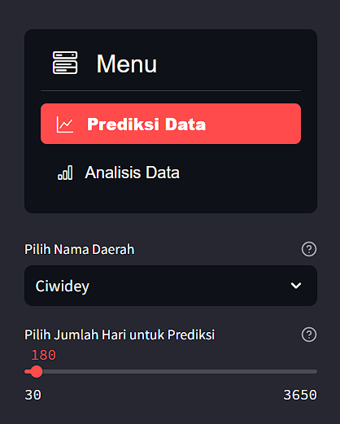

# Prediction of electricity consumption in Bandung area, Indonesia

## Description
This project aims to predict electricity consumption in the Bandung area, Indonesia, especially the Ciwidey, Dago, Lembang, Banjaran and Cibiru areas. This project performs program-based predictions using the ARIMA (AutoRegressive Integrated Moving Average) statistical model approach. The data source used is time series data generated for 10 years (January 1, 2014 - January 1, 2024) as input in the prediction model. The prediction results of this project aim to manage the distribution of coal processing at PLTU in Indonesia.

## Streamlit web overview

